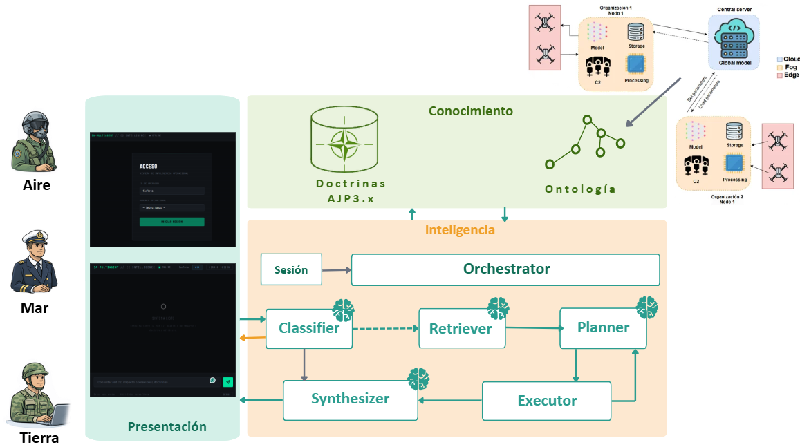

# SA-MultiAgent

**Sistema multiagente para operaciones multidominio en la nube de combate.**

SA-MultiAgent permite que operadores de distintos dominios (aire, tierra y mar) consulten en lenguaje natural fuentes de conocimiento heterogéneas sobre un escenario de la nube de combate que incluye redes de mando y control (C2), flotas de drones y nodos que ejecutan algoritmos de aprendizaje federado. El sistema combina conocimiento estructurado (ontología OWL/RDF servida con Apache Jena Fuseki vía SPARQL) y conocimiento doctrinal no estructurado (publicaciones OTAN AJP-3.1, AJP-3.2 y AJP-3.3 indexadas en ChromaDB), coordinados por una tubería de cinco agentes LLM (GPT-4.1 con PydanticAI y arquitectura ReWOO).

> Trabajo Fin de Máster — UPM / ETSIT.

---

## Tabla de contenidos

1. [Arquitectura](#arquitectura)
2. [Requisitos previos](#requisitos-previos)
3. [Inicio rápido (plug-and-play)](#inicio-rápido-plug-and-play)
4. [Configuración](#configuración)
5. [Estructura del proyecto](#estructura-del-proyecto)
6. [Datos: ontología y corpus doctrinal](#datos-ontología-y-corpus-doctrinal)
7. [Uso](#uso)
---

## Arquitectura

El sistema expone una API que ejecuta una tubería fija de cinco etapas por cada consulta. Cada etapa es una única llamada al LLM con salida estructurada (Pydantic).

```
POST /query
  → Clasificador  → etiqueta la consulta (smalltalk | doctrine_question | ontology_with_context
                    | ontology_question | unclear)
  → Recuperador   → recupera contexto de ChromaDB y expande términos 
  → Planificador  → emite un plan ordenado de llamadas a herramientas;
                    puede invocar el subagente sparql_from_nl
  → Ejecutor      → ejecuta las herramientas en orden, resuelve las
                    referencias {{Ek}} entre pasos y puede re-planificar (≤2)
  → Sintetizador  → compone la respuesta final con citas, patrón detectado
                    y lista de entidades


```
En la siguiente imagen se puede ver una visión general de la arquitectura propuesta:

<p align="center">
  
</p>


**Caminos cortos:**

- `smalltalk` → Clasificador → Sintetizador (omite Recuperador, Planificador y Ejecutor).
- `unclear` → el Clasificador devuelve una pregunta de aclaración y la tubería se detiene.

**Servicios (contenedores):**

| Servicio   | Imagen / build        | Puerto | Función                                  |
|------------|-----------------------|--------|------------------------------------------|
| `fuseki`   | `stain/jena-fuseki`   | 3030   | Almacén de tripletas (ontología, SPARQL) |
| `api`      | `Dockerfile.api`      | 8000   | Backend FastAPI con el pipeline de agentes |
| `frontend` | `Dockerfile.frontend` | 8080   | Interfaz web servida con Nginx     |

---

## Requisitos previos

- **Docker** y **Docker Compose** (Docker Desktop en Windows o macOS ya incluyen ambos).
- Una **clave de API de OpenAI** con acceso a los modelos GPT-4.1.

No se necesita instalar Python, Fuseki ni ChromaDB en el equipo anfitrión: todo corre dentro de contenedores.

---

## Inicio rápido (plug-and-play)

Tres pasos. Desde la raíz del proyecto:

```bash
# 1) Crear el fichero de entorno y poner la clave de OpenAI
cp .env.example .env
#    Edita .env y sustituye el valor de OPENAI_API_KEY

# 2) Levantar todo el sistema
docker-compose up --build

# 3) Abrir la interfaz en el navegador
#    http://localhost:8080
```

Eso es todo. Al arrancar, el contenedor `api` espera a que Fuseki esté listo, crea el dataset, carga la ontología en el grafo nombrado y lanza el backend de forma automática. El corpus doctrinal ya viene indexado en el repositorio, por lo que **no hay que reconstruir nada**.

Servicios disponibles tras el arranque:

- Interfaz web: <http://localhost:8080>
- API (documentación interactiva): <http://localhost:8000/docs>
- Fuseki (consola de administración): <http://localhost:3030>

Para detener el sistema: `Ctrl + C`, y luego `docker-compose down` (añade `-v` para borrar también el volumen de Fuseki y forzar una recarga limpia de la ontología).

---

## Configuración

Toda la configuración vive en el fichero `.env` (a partir de `.env.example`). La única variable obligatoria es `OPENAI_API_KEY`; el resto tiene valores por defecto razonables.

| Variable | Por defecto | Descripción |
|----------|-------------|-------------|
| `OPENAI_API_KEY` | — | **Obligatoria.** Clave de la API de OpenAI. |
| `CLASSIFIER_MODEL` | `gpt-4.1-mini` | Modelo del Clasificador. |
| `PLANNER_MODEL` | `gpt-4.1` | Modelo del Planificador. |
| `SYNTHESIZER_MODEL` | `gpt-4.1` | Modelo del Sintetizador. |
| `NL_SPARQL_MODEL` | `gpt-4.1` | Modelo del subagente `sparql_from_nl`. |
| `RETRIEVER_MODEL` | `gpt-4.1-mini` | Modelo de expansión de términos del Recuperador. |
| `RETRIEVER_TOP_K` | `6` | Número de fragmentos recuperados de ChromaDB. |
| `RETRIEVER_MIN_SCORE` | `0.10` | Puntuación de similitud mínima para conservar un fragmento. |
| `CLASSIFIER_CONFIDENCE_THRESHOLD` | `0.6` | Por debajo de este umbral la consulta se clasifica como `unclear`. |
| `CLASSIFIER_HISTORY_TURNS` | `5` | Turnos de conversación pasados al Clasificador. |
| `PLANNER_HISTORY_TURNS` | `5` | Turnos de conversación pasados al Planificador. |
| `EXECUTOR_TRANSIENT_RETRIES` | `3` | Reintentos máximos ante errores transitorios. |
| `EXECUTOR_BACKOFF_BASE` | `1.0` | Base del *backoff* exponencial (segundos). |
| `EXECUTOR_MAX_REPLANS` | `2` | Ciclos máximos de re-planificación por consulta. |
| `LOG_LEVEL` | `INFO` | Nivel de registro. |

Las variables de conexión a Fuseki (`FUSEKI_ENDPOINT`, `FUSEKI_GRAPH`, `FUSEKI_DATASET`) las fija `docker-compose.yml` automáticamente; solo hace falta definirlas a mano para la ejecución en local sin Docker.

---

## Estructura del proyecto

```
.
├── agents/                  Agentes del pipeline (clasificador, recuperador, planificador…)
│   └── execution/           Ejecutor, runner de herramientas y resolución de referencias
├── orchestration/           Orquestador: conecta las cinco etapas
├── prompts/                 Prompts de sistema de cada agente
├── tools/                   Catálogo de herramientas, recuperador doctrinal, ejecutor SPARQL
├── ontologia/
│   └── ontologia.ttl        Ontología RDF/OWL (drones, nodos C2, flujos de datos, roles)
├── rag/
│   ├── data/
│   │   ├── raw/             PDF doctrinales originales (AJP-3.1/3.2/3.3)
│   │   ├── processed/       Páginas y fragmentos (JSONL) + léxicos
│   │   └── chroma/          Índice vectorial ChromaDB ya construido
│   └── src/                 Código de ingesta e indexación (build_index.py)
├── scripts/                 Scripts de arranque (entrypoint) y utilidades
├── evaluacion/              Conjuntos de evaluación y métricas (RAGAS)
├── frontend/                Interfaz web + Nginx
├── api.py                   Aplicación FastAPI (/login, /query, /session, /health)
├── models.py                Modelos Pydantic compartidos
├── session.py                Almacén de sesiones en memoria
├── requirements.txt         Dependencias de Python
├── .env.example              Plantilla de configuración
├── docker-compose.yml        Orquestación de los tres servicios
├── Dockerfile.api            Imagen del backend
└── Dockerfile.frontend       Imagen del frontend
```

---

## Datos: ontología y corpus doctrinal

**Ontología.** Reside en `ontologia/ontologia.ttl` (≈ 1.158 tripletas; 11 clases, 109 individuos y 17 propiedades de objeto). Describe la topología de la red de drones, los nodos C2, los flujos de datos y los roles operativos. Se carga en Fuseki de forma automática al arrancar la API, en el grafo nombrado `<urn:scenario:static>`. Para modificarla, edita el `.ttl` y reinicia el sistema con el volumen limpio:

```bash
docker-compose down -v && docker-compose up --build
```

**Corpus doctrinal.** Los PDF de las publicaciones AJP de la OTAN viven en `rag/data/raw/`. La canalización de ingesta (`rag/src/build_index.py`) los segmenta por sección (capítulo y sección), genera los fragmentos en `rag/data/processed/` y construye el índice vectorial en `rag/data/chroma/` con embeddings multilingües (`paraphrase-multilingual-mpnet-base-v2`). **Todo esto ya viene generado en el repositorio**, así que el sistema funciona sin pasos adicionales.

Solo si necesitas regenerar el índice (por ejemplo, tras cambiar los PDF), ejecuta dentro del contenedor:

```bash
docker exec -it sa_api python rag/src/build_index.py
```

El mapeo dominio → doctrina que usa el Recuperador es: `aire → AJP-3.3`, `tierra → AJP-3.2`, `mar → AJP-3.1`.

---

## Uso

### Desde la interfaz web

Abre <http://localhost:8080>, inicia sesión indicando el identificador de operador y el dominio (aire, tierra o mar) y formula consultas en lenguaje natural. El dominio es inmutable durante la sesión.

### Desde la API (ejemplo con `curl`)

```bash
# 1) Iniciar sesión y obtener el identificador de sesión
curl -X POST http://localhost:8000/login \
  -H "Content-Type: application/json" \
  -d '{"operator_id": "OP-01", "domain": "air"}'

# 2) Lanzar una consulta (usa el X-Session-ID devuelto en el paso anterior)
curl -X POST http://localhost:8000/query \
  -H "Content-Type: application/json" \
  -H "X-Session-ID: <id-de-sesion>" \
  -d '{"text": "¿Qué drones están operativos y a qué nodo C2 pertenecen?"}'
```

### Endpoints

| Método | Ruta | Descripción |
|--------|------|-------------|
| `POST` | `/login` | Crea una sesión y fija el dominio del operador. |
| `POST` | `/query` | Ejecuta la tubería completa y devuelve la respuesta. |
| `GET`  | `/session` | Recupera el estado de la sesión actual. |
| `GET`  | `/health` | Comprobación de estado del servicio. |

Las sesiones son **solo en memoria** (no hay base de datos): se pierden al reiniciar la API. Todas las peticiones tras `/login` requieren la cabecera `X-Session-ID`.


